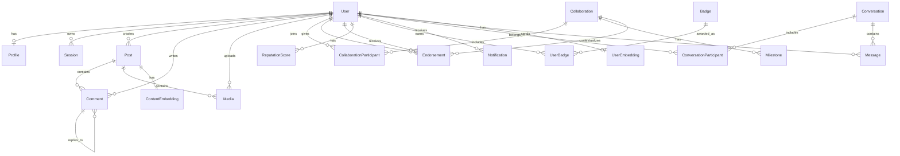

# ConnextionZ Platform — Database Schema

> **Version:** 1.0  
> **Last Updated:** 2026-07-07  
> **Database:** PostgreSQL 16 + pgvector  
> **ORM:** SQLAlchemy 2.0 (async)  
> **Migrations:** Alembic  

---

## Table of Contents

1. [Overview](#overview)
2. [Entity-Relationship Diagram](#entity-relationship-diagram)
3. [Conventions](#conventions)
4. [Core Tables](#core-tables)
   - [Users & Authentication](#users--authentication)
   - [Profiles](#profiles)
   - [Sessions](#sessions)
5. [Content Tables](#content-tables)
   - [Posts](#posts)
   - [Comments](#comments)
   - [Media](#media)
6. [Collaboration Tables](#collaboration-tables)
   - [Collaborations](#collaborations)
   - [Collaboration Participants](#collaboration-participants)
   - [Milestones](#milestones)
7. [Reputation Tables](#reputation-tables)
   - [Reputation Scores](#reputation-scores)
   - [Endorsements](#endorsements)
   - [Badges & User Badges](#badges--user-badges)
8. [Embedding Tables (pgvector)](#embedding-tables-pgvector)
   - [User Embeddings](#user-embeddings)
   - [Content Embeddings](#content-embeddings)
9. [Messaging Tables](#messaging-tables)
   - [Conversations](#conversations)
   - [Messages](#messages)
10. [Notifications](#notifications)
11. [Indexing Strategy](#indexing-strategy)
12. [Migration Guide](#migration-guide)

---

## Overview

The ConnextionZ database is designed as a **relational schema with vector search capabilities** to support all 14 platform features. It uses:

| Technology | Purpose |
|-----------|---------|
| **PostgreSQL 16** | Primary relational store |
| **pgvector** | Vector embeddings for Two-Tower recommendation model |
| **Redis** | Session cache, rate limiting, feed cache warming |
| **RabbitMQ** | Async task queue (notifications, embeddings, analytics) |

### Design Principles

1. **UUIDv7 Primary Keys** — Time-sortable, globally unique, cursor-pagination friendly
2. **Soft Deletes** — `deleted_at` timestamp on all major tables; no data is ever hard-deleted
3. **Denormalized Counters** — `like_count`, `follower_count`, etc. stored on parent rows for fast reads
4. **JSONB for Flexible Data** — Tags, social links, device info stored as JSONB
5. **Timestamps as ISO 8601 Strings** — For API-facing date fields; `DateTime(timezone=True)` for internal use
6. **Async-First** — All queries use SQLAlchemy async with `asyncpg` driver

---

## Entity-Relationship Diagram



---

## Conventions

### Column Naming

| Pattern | Example | Meaning |
|---------|---------|---------|
| `*_id` | `user_id`, `post_id` | Foreign key reference |
| `*_at` | `created_at`, `deleted_at` | Timestamp column |
| `*_count` | `like_count`, `view_count` | Denormalized counter |
| `*_url` | `avatar_url`, `website_url` | URL string |
| `is_*` | `is_read`, `is_edited` | Boolean flag |
| `has_*` | _(reserved for future)_ | Boolean flag |

### Data Types

| Application Type | PostgreSQL Type | SQLAlchemy Type |
|-----------------|----------------|-----------------|
| UUID | `UUID` | `UUID(as_uuid=True)` |
| Short text (≤256) | `VARCHAR(n)` | `String(n)` |
| Long text | `TEXT` | `Text` |
| Boolean | `BOOLEAN` | `Boolean` |
| Integer | `INTEGER` | `Integer` |
| Float | `DOUBLE PRECISION` | `Float` |
| Timestamp (TZ) | `TIMESTAMPTZ` | `DateTime(timezone=True)` |
| JSON | `JSONB` | `JSONB` |
| Enum | Custom ENUM | `Enum` |
| Vector | `vector(n)` | `Vector(n)` (pgvector) |

---

## Core Tables

### Users & Authentication

**Table: `users`** — Core identity and authentication.

| Column | Type | Constraints | Description |
|--------|------|-------------|-------------|
| `id` | `UUID` | PK, default: UUIDv7 | Unique user identifier |
| `email` | `VARCHAR(320)` | UNIQUE, NOT NULL, INDEXED | User email address |
| `username` | `VARCHAR(64)` | UNIQUE, NOT NULL, INDEXED | Public username |
| `hashed_password` | `VARCHAR(128)` | NOT NULL | bcrypt hash (cost ≥ 12) |
| `role` | `ENUM(user_role)` | NOT NULL, default: `user` | `admin` > `creator` > `user` > `guest` |
| `status` | `ENUM(account_status)` | NOT NULL, default: `pending_verification` | `active`, `suspended`, `banned`, `pending_verification` |
| `email_verified` | `BOOLEAN` | NOT NULL, default: false | Whether email has been verified |
| `email_verified_at` | `TIMESTAMPTZ` | NULLABLE | When email was verified |
| `mfa_enabled` | `BOOLEAN` | NOT NULL, default: false | Whether MFA is enabled |
| `last_login_at` | `TIMESTAMPTZ` | NULLABLE | Last successful login timestamp |
| `last_login_ip` | `VARCHAR(45)` | NULLABLE | IPv4 or IPv6 address |
| `created_at` | `TIMESTAMPTZ` | NOT NULL, server_default: `now()` | Row creation time |
| `updated_at` | `TIMESTAMPTZ` | NOT NULL, server_default: `now()` | Last update time |
| `deleted_at` | `TIMESTAMPTZ` | NULLABLE | Soft delete timestamp |

**Indexes:**
- `ix_users_email` — B-tree on `email` (unique lookup)
- `ix_users_username` — B-tree on `username` (unique lookup)

**Role Hierarchy:**
```
admin → creator → user → guest
```
Higher roles inherit all permissions of lower roles.

---

### Profiles

**Table: `profiles`** — Public-facing creator profile (1:1 with `users`).

| Column | Type | Constraints | Description |
|--------|------|-------------|-------------|
| `id` | `UUID` | PK | Profile identifier |
| `user_id` | `UUID` | FK → users.id, UNIQUE, NOT NULL, INDEXED | Owning user |
| `display_name` | `VARCHAR(128)` | NOT NULL | Public display name |
| `bio` | `TEXT` | NULLABLE | Creator biography |
| `avatar_url` | `VARCHAR(2048)` | NULLABLE | Profile picture URL |
| `cover_image_url` | `VARCHAR(2048)` | NULLABLE | Cover/banner image URL |
| `website_url` | `VARCHAR(2048)` | NULLABLE | Personal website |
| `location` | `VARCHAR(256)` | NULLABLE | Geographic location |
| `social_links` | `JSONB` | NULLABLE | `{"youtube": "...", "instagram": "..."}` |
| `tags` | `JSONB` | NULLABLE | `["music", "comedy", "dance"]` |
| `follower_count` | `INTEGER` | NOT NULL, default: 0 | Denormalized follower count |
| `following_count` | `INTEGER` | NOT NULL, default: 0 | Denormalized following count |
| `collaboration_count` | `INTEGER` | NOT NULL, default: 0 | Denormalized collaboration count |
| `total_likes` | `INTEGER` | NOT NULL, default: 0 | Denormalized total likes received |
| `created_at` | `TIMESTAMPTZ` | NOT NULL | Row creation time |
| `updated_at` | `TIMESTAMPTZ` | NOT NULL | Last update time |
| `deleted_at` | `TIMESTAMPTZ` | NULLABLE | Soft delete timestamp |

**Indexes:**
- `ix_profiles_user_id` — B-tree on `user_id` (1:1 lookup)

---

### Sessions

**Table: `sessions`** — Persistent session records for audit and token management.

> **Note:** Active session data lives in Redis for performance. This table provides durable audit trail and token blacklisting.

| Column | Type | Constraints | Description |
|--------|------|-------------|-------------|
| `id` | `UUID` | PK | Session identifier |
| `user_id` | `UUID` | FK → users.id, NOT NULL, INDEXED | Session owner |
| `refresh_token_jti` | `VARCHAR(64)` | UNIQUE, NOT NULL, INDEXED | JWT ID of refresh token |
| `access_token_jti` | `VARCHAR(64)` | NULLABLE | JWT ID of current access token |
| `expires_at` | `TIMESTAMPTZ` | NOT NULL | When the refresh token expires |
| `revoked_at` | `TIMESTAMPTZ` | NULLABLE | When session was revoked (logout) |
| `ip_address` | `VARCHAR(45)` | NULLABLE | Client IP at session creation |
| `user_agent` | `TEXT` | NULLABLE | Client user-agent string |
| `device_info` | `JSONB` | NULLABLE | `{"os": "iOS", "version": "17.0"}` |
| `created_at` | `TIMESTAMPTZ` | NOT NULL | Session creation time |
| `updated_at` | `TIMESTAMPTZ` | NOT NULL | Last update time |

**Indexes:**
- `ix_sessions_user_id` — B-tree on `user_id`
- `ix_sessions_refresh_token_jti` — B-tree on `refresh_token_jti` (unique)

---

## Content Tables

### Posts

**Table: `posts`** — The primary content unit.

| Column | Type | Constraints | Description |
|--------|------|-------------|-------------|
| `id` | `UUID` | PK | Post identifier |
| `user_id` | `UUID` | FK → users.id, NOT NULL, INDEXED | Post author |
| `content_type` | `ENUM(content_type)` | NOT NULL, default: `post` | `post`, `video`, `image`, `audio`, `live_stream` |
| `status` | `ENUM(content_status)` | NOT NULL, default: `draft` | `draft`, `published`, `archived`, `flagged`, `removed` |
| `title` | `VARCHAR(512)` | NULLABLE | Post title |
| `body` | `TEXT` | NULLABLE | Post body text |
| `caption` | `TEXT` | NULLABLE | Short caption/description |
| `tags` | `JSONB` | NULLABLE | `["music", "tutorial"]` |
| `mentions` | `JSONB` | NULLABLE | `[{"user_id": "...", "username": "..."}]` |
| `sound_track` | `VARCHAR(256)` | NULLABLE | Associated sound/track name |
| `like_count` | `INTEGER` | NOT NULL, default: 0 | Denormalized |
| `comment_count` | `INTEGER` | NOT NULL, default: 0 | Denormalized |
| `share_count` | `INTEGER` | NOT NULL, default: 0 | Denormalized |
| `view_count` | `INTEGER` | NOT NULL, default: 0 | Denormalized |
| `scheduled_at` | `VARCHAR(64)` | NULLABLE | ISO 8601 scheduled publish time |
| `published_at` | `VARCHAR(64)` | NULLABLE | ISO 8601 actual publish time |
| `created_at` | `TIMESTAMPTZ` | NOT NULL | Row creation time |
| `updated_at` | `TIMESTAMPTZ` | NOT NULL | Last update time |
| `deleted_at` | `TIMESTAMPTZ` | NULLABLE | Soft delete timestamp |

**Indexes:**
- `ix_posts_user_id` — B-tree on `user_id`
- `ix_posts_content_type` — B-tree on `content_type`
- `ix_posts_status` — B-tree on `status`
- `ix_posts_published_at` — B-tree on `published_at` (feed ordering)

---

### Comments

**Table: `comments`** — Supports nested replies via `parent_id` self-reference.

| Column | Type | Constraints | Description |
|--------|------|-------------|-------------|
| `id` | `UUID` | PK | Comment identifier |
| `post_id` | `UUID` | FK → posts.id, NOT NULL, INDEXED | Parent post |
| `user_id` | `UUID` | FK → users.id, NOT NULL, INDEXED | Comment author |
| `parent_id` | `UUID` | FK → comments.id, NULLABLE, INDEXED | Parent comment (for replies) |
| `body` | `TEXT` | NOT NULL | Comment text |
| `is_edited` | `BOOLEAN` | NOT NULL, default: false | Whether comment was edited |
| `like_count` | `INTEGER` | NOT NULL, default: 0 | Denormalized |
| `created_at` | `TIMESTAMPTZ` | NOT NULL | Row creation time |
| `updated_at` | `TIMESTAMPTZ` | NOT NULL | Last update time |
| `deleted_at` | `TIMESTAMPTZ` | NULLABLE | Soft delete timestamp |

**Indexes:**
- `ix_comments_post_id` — B-tree on `post_id`
- `ix_comments_user_id` — B-tree on `user_id`
- `ix_comments_parent_id` — B-tree on `parent_id` (threaded replies)

---

### Media

**Table: `media`** — Files attached to posts.

| Column | Type | Constraints | Description |
|--------|------|-------------|-------------|
| `id` | `UUID` | PK | Media identifier |
| `post_id` | `UUID` | FK → posts.id, NOT NULL, INDEXED | Parent post |
| `user_id` | `UUID` | FK → users.id, NOT NULL, INDEXED | Uploader |
| `media_type` | `VARCHAR(64)` | NOT NULL | MIME type: `image/jpeg`, `video/mp4` |
| `url` | `VARCHAR(2048)` | NOT NULL | Public CDN URL |
| `thumbnail_url` | `VARCHAR(2048)` | NULLABLE | Thumbnail URL |
| `file_size_bytes` | `INTEGER` | NULLABLE | File size |
| `width` | `INTEGER` | NULLABLE | Image/video width (px) |
| `height` | `INTEGER` | NULLABLE | Image/video height (px) |
| `duration_seconds` | `FLOAT` | NULLABLE | Video/audio duration |
| `storage_provider` | `VARCHAR(32)` | NOT NULL, default: `s3` | `s3`, `local` |
| `storage_key` | `VARCHAR(1024)` | NOT NULL | Object key in storage |
| `is_processed` | `BOOLEAN` | NOT NULL, default: false | Transcoding/thumbnail complete |
| `processing_error` | `TEXT` | NULLABLE | Error message if processing failed |
| `created_at` | `TIMESTAMPTZ` | NOT NULL | Row creation time |
| `updated_at` | `TIMESTAMPTZ` | NOT NULL | Last update time |
| `deleted_at` | `TIMESTAMPTZ` | NULLABLE | Soft delete timestamp |

**Indexes:**
- `ix_media_post_id` — B-tree on `post_id`
- `ix_media_user_id` — B-tree on `user_id`

---

## Collaboration Tables

### Collaborations

**Table: `collaborations`** — A collaboration proposal/agreement between creators.

| Column | Type | Constraints | Description |
|--------|------|-------------|-------------|
| `id` | `UUID` | PK | Collaboration identifier |
| `initiator_id` | `UUID` | FK → users.id, NOT NULL, INDEXED | Who started the collaboration |
| `title` | `VARCHAR(512)` | NOT NULL | Collaboration title |
| `description` | `TEXT` | NULLABLE | Detailed description |
| `status` | `ENUM(collaboration_status)` | NOT NULL, default: `proposed` | Lifecycle state |
| `content_type` | `VARCHAR(64)` | NULLABLE | `video`, `podcast`, `livestream` |
| `platform` | `VARCHAR(64)` | NULLABLE | Target platform: `youtube`, `tiktok` |
| `tags` | `JSONB` | NULLABLE | Categorization tags |
| `proposed_at` | `VARCHAR(64)` | NULLABLE | ISO 8601 proposal time |
| `started_at` | `VARCHAR(64)` | NULLABLE | ISO 8601 start time |
| `completed_at` | `VARCHAR(64)` | NULLABLE | ISO 8601 completion time |
| `budget_min` | `FLOAT` | NULLABLE | Minimum budget |
| `budget_max` | `FLOAT` | NULLABLE | Maximum budget |
| `budget_currency` | `VARCHAR(3)` | NOT NULL, default: `USD` | ISO 4217 currency code |
| `created_at` | `TIMESTAMPTZ` | NOT NULL | Row creation time |
| `updated_at` | `TIMESTAMPTZ` | NOT NULL | Last update time |
| `deleted_at` | `TIMESTAMPTZ` | NULLABLE | Soft delete timestamp |

**Status Lifecycle:**
```
proposed → accepted → in_progress → completed
                 ↘ declined       ↘ cancelled
```

**Indexes:**
- `ix_collaborations_initiator_id` — B-tree on `initiator_id`
- `ix_collaborations_status` — B-tree on `status`

---

### Collaboration Participants

**Table: `collaboration_participants`** — Many-to-many join between users and collaborations.

| Column | Type | Constraints | Description |
|--------|------|-------------|-------------|
| `id` | `UUID` | PK | Join record identifier |
| `collaboration_id` | `UUID` | FK → collaborations.id, NOT NULL, INDEXED | Collaboration |
| `user_id` | `UUID` | FK → users.id, NOT NULL, INDEXED | Participant |
| `role` | `VARCHAR(64)` | NOT NULL, default: `participant` | `initiator`, `participant`, `sponsor` |
| `accepted` | `BOOLEAN` | NOT NULL, default: false | Has user accepted the invite |
| `accepted_at` | `VARCHAR(64)` | NULLABLE | ISO 8601 acceptance time |
| `created_at` | `TIMESTAMPTZ` | NOT NULL | Row creation time |
| `updated_at` | `TIMESTAMPTZ` | NOT NULL | Last update time |

**Indexes:**
- `ix_collab_participants_collab_id` — B-tree on `collaboration_id`
- `ix_collab_participants_user_id` — B-tree on `user_id`

---

### Milestones

**Table: `milestones`** — Deliverable milestones within a collaboration.

| Column | Type | Constraints | Description |
|--------|------|-------------|-------------|
| `id` | `UUID` | PK | Milestone identifier |
| `collaboration_id` | `UUID` | FK → collaborations.id, NOT NULL, INDEXED | Parent collaboration |
| `title` | `VARCHAR(512)` | NOT NULL | Milestone title |
| `description` | `TEXT` | NULLABLE | Detailed description |
| `status` | `ENUM(milestone_status)` | NOT NULL, default: `pending` | `pending`, `in_progress`, `completed`, `disputed` |
| `sort_order` | `INTEGER` | NOT NULL, default: 0 | Display ordering |
| `due_at` | `VARCHAR(64)` | NULLABLE | ISO 8601 due date |
| `completed_at` | `VARCHAR(64)` | NULLABLE | ISO 8601 completion time |
| `created_at` | `TIMESTAMPTZ` | NOT NULL | Row creation time |
| `updated_at` | `TIMESTAMPTZ` | NOT NULL | Last update time |

**Indexes:**
- `ix_milestones_collaboration_id` — B-tree on `collaboration_id`

---

## Reputation Tables

### Reputation Scores

**Table: `reputation_scores`** — Aggregate reputation per user (1:1).

| Column | Type | Constraints | Description |
|--------|------|-------------|-------------|
| `id` | `UUID` | PK | Score record identifier |
| `user_id` | `UUID` | FK → users.id, UNIQUE, NOT NULL, INDEXED | Scored user |
| `overall_score` | `FLOAT` | NOT NULL, default: 0.0 | Composite 0–100 score |
| `collaboration_score` | `FLOAT` | NOT NULL, default: 0.0 | Collaboration quality sub-score |
| `content_quality_score` | `FLOAT` | NOT NULL, default: 0.0 | Content quality sub-score |
| `community_score` | `FLOAT` | NOT NULL, default: 0.0 | Community engagement sub-score |
| `reliability_score` | `FLOAT` | NOT NULL, default: 0.0 | On-time delivery sub-score |
| `total_endorsements` | `INTEGER` | NOT NULL, default: 0 | Raw endorsement count |
| `completed_collaborations` | `INTEGER` | NOT NULL, default: 0 | Completed collaboration count |
| `on_time_delivery_rate` | `FLOAT` | NOT NULL, default: 0.0 | Percentage on-time |
| `score_version` | `INTEGER` | NOT NULL, default: 1 | Algorithm version |
| `computed_at` | `VARCHAR(64)` | NULLABLE | ISO 8601 last computation time |
| `created_at` | `TIMESTAMPTZ` | NOT NULL | Row creation time |
| `updated_at` | `TIMESTAMPTZ` | NOT NULL | Last update time |

**Indexes:**
- `ix_reputation_scores_user_id` — B-tree on `user_id` (unique)

---

### Endorsements

**Table: `endorsements`** — Peer endorsements between users.

| Column | Type | Constraints | Description |
|--------|------|-------------|-------------|
| `id` | `UUID` | PK | Endorsement identifier |
| `endorser_id` | `UUID` | FK → users.id, NOT NULL, INDEXED | Who gave the endorsement |
| `endorsee_id` | `UUID` | FK → users.id, NOT NULL, INDEXED | Who received the endorsement |
| `category` | `VARCHAR(64)` | NOT NULL | `collaboration`, `creativity`, `reliability`, `communication` |
| `comment` | `TEXT` | NULLABLE | Written endorsement |
| `rating` | `INTEGER` | NOT NULL | 1–5 star rating |
| `collaboration_id` | `UUID` | FK → collaborations.id, NULLABLE | Context collaboration |
| `created_at` | `TIMESTAMPTZ` | NOT NULL | Row creation time |
| `updated_at` | `TIMESTAMPTZ` | NOT NULL | Last update time |

**Indexes:**
- `ix_endorsements_endorser_id` — B-tree on `endorser_id`
- `ix_endorsements_endorsee_id` — B-tree on `endorsee_id`

---

### Badges & User Badges

**Table: `badges`** — Badge definitions.

| Column | Type | Constraints | Description |
|--------|------|-------------|-------------|
| `id` | `UUID` | PK | Badge identifier |
| `name` | `VARCHAR(128)` | UNIQUE, NOT NULL | Badge name |
| `description` | `TEXT` | NULLABLE | Badge description |
| `icon_url` | `VARCHAR(2048)` | NULLABLE | Badge icon URL |
| `category` | `VARCHAR(64)` | NOT NULL | `collaboration`, `content`, `community`, `milestone` |
| `tier` | `INTEGER` | NOT NULL, default: 1 | 1=bronze, 2=silver, 3=gold, 4=platinum |
| `criteria` | `JSONB` | NULLABLE | `{"min_collaborations": 10}` |
| `created_at` | `TIMESTAMPTZ` | NOT NULL | Row creation time |
| `updated_at` | `TIMESTAMPTZ` | NOT NULL | Last update time |

**Table: `user_badges`** — Badges awarded to users.

| Column | Type | Constraints | Description |
|--------|------|-------------|-------------|
| `id` | `UUID` | PK | Award identifier |
| `user_id` | `UUID` | FK → users.id, NOT NULL, INDEXED | Badge recipient |
| `badge_id` | `UUID` | FK → badges.id, NOT NULL, INDEXED | Awarded badge |
| `awarded_at` | `VARCHAR(64)` | NULLABLE | ISO 8601 award time |
| `awarded_by` | `UUID` | NULLABLE | Admin/system user who awarded |
| `created_at` | `TIMESTAMPTZ` | NOT NULL | Row creation time |
| `updated_at` | `TIMESTAMPTZ` | NOT NULL | Last update time |

**Indexes:**
- `ix_user_badges_user_id` — B-tree on `user_id`
- `ix_user_badges_badge_id` — B-tree on `badge_id`

---

## Embedding Tables (pgvector)

### User Embeddings

**Table: `user_embeddings`** — Vector representation of users (Creator Tower).

| Column | Type | Constraints | Description |
|--------|------|-------------|-------------|
| `id` | `UUID` | PK | Embedding record identifier |
| `user_id` | `UUID` | FK → users.id, UNIQUE, NOT NULL, INDEXED | Embedded user |
| `embedding` | `vector(384)` | NOT NULL | 384-dim dense vector |
| `model_name` | `VARCHAR(128)` | NOT NULL, default: `all-MiniLM-L6-v2` | Embedding model |
| `model_version` | `VARCHAR(32)` | NOT NULL, default: `1.0` | Model version |
| `source_text_hash` | `VARCHAR(64)` | NULLABLE | SHA-256 of source text for cache invalidation |
| `created_at` | `TIMESTAMPTZ` | NOT NULL | Row creation time |
| `updated_at` | `TIMESTAMPTZ` | NOT NULL | Last update time |

**Indexes:**
- `ix_user_embeddings_user_id` — B-tree on `user_id` (unique)
- `ix_user_embeddings_ivfflat` — IVFFlat on `embedding` with `vector_cosine_ops` (100 lists)

**ANN Query Example:**
```sql
SELECT user_id, embedding <=> $query_vector AS distance
FROM user_embeddings
ORDER BY embedding <=> $query_vector
LIMIT 50;
```

---

### Content Embeddings

**Table: `content_embeddings`** — Vector representation of content (Item Tower).

| Column | Type | Constraints | Description |
|--------|------|-------------|-------------|
| `id` | `UUID` | PK | Embedding record identifier |
| `post_id` | `UUID` | FK → posts.id, UNIQUE, NOT NULL, INDEXED | Embedded post |
| `embedding` | `vector(384)` | NOT NULL | 384-dim dense vector |
| `model_name` | `VARCHAR(128)` | NOT NULL, default: `all-MiniLM-L6-v2` | Embedding model |
| `model_version` | `VARCHAR(32)` | NOT NULL, default: `1.0` | Model version |
| `source_text_hash` | `VARCHAR(64)` | NULLABLE | SHA-256 of source text |
| `created_at` | `TIMESTAMPTZ` | NOT NULL | Row creation time |
| `updated_at` | `TIMESTAMPTZ` | NOT NULL | Last update time |

**Indexes:**
- `ix_content_embeddings_post_id` — B-tree on `post_id` (unique)
- `ix_content_embeddings_ivfflat` — IVFFlat on `embedding` with `vector_cosine_ops` (100 lists)

---

## Messaging Tables

### Conversations

**Table: `conversations`** — A messaging thread.

| Column | Type | Constraints | Description |
|--------|------|-------------|-------------|
| `id` | `UUID` | PK | Conversation identifier |
| `title` | `VARCHAR(256)` | NULLABLE | Group chat name |
| `is_group` | `BOOLEAN` | NOT NULL, default: false | Group vs. 1:1 conversation |
| `last_message_text` | `TEXT` | NULLABLE | Preview of last message (denormalized) |
| `last_message_at` | `VARCHAR(64)` | NULLABLE | ISO 8601 last message time |
| `last_message_by` | `UUID` | NULLABLE | User ID of last sender |
| `created_at` | `TIMESTAMPTZ` | NOT NULL | Row creation time |
| `updated_at` | `TIMESTAMPTZ` | NOT NULL | Last update time |
| `deleted_at` | `TIMESTAMPTZ` | NULLABLE | Soft delete timestamp |

---

### Conversation Participants

**Table: `conversation_participants`** — Many-to-many join.

| Column | Type | Constraints | Description |
|--------|------|-------------|-------------|
| `id` | `UUID` | PK | Join record identifier |
| `conversation_id` | `UUID` | FK → conversations.id, NOT NULL, INDEXED | Conversation |
| `user_id` | `UUID` | FK → users.id, NOT NULL, INDEXED | Participant |
| `is_admin` | `BOOLEAN` | NOT NULL, default: false | Group admin flag |
| `last_read_at` | `VARCHAR(64)` | NULLABLE | ISO 8601 last read timestamp |
| `is_muted` | `BOOLEAN` | NOT NULL, default: false | Muted conversation |
| `created_at` | `TIMESTAMPTZ` | NOT NULL | Row creation time |
| `updated_at` | `TIMESTAMPTZ` | NOT NULL | Last update time |

**Indexes:**
- `ix_conv_participants_conv_id` — B-tree on `conversation_id`
- `ix_conv_participants_user_id` — B-tree on `user_id`

---

### Messages

**Table: `messages`** — Individual messages.

| Column | Type | Constraints | Description |
|--------|------|-------------|-------------|
| `id` | `UUID` | PK | Message identifier |
| `conversation_id` | `UUID` | FK → conversations.id, NOT NULL, INDEXED | Parent conversation |
| `sender_id` | `UUID` | FK → users.id, NOT NULL, INDEXED | Message sender |
| `body` | `TEXT` | NOT NULL | Message text |
| `content_type` | `VARCHAR(32)` | NOT NULL, default: `text` | `text`, `image`, `file`, `collaboration_invite` |
| `attachments` | `JSONB` | NULLABLE | `[{"url": "...", "type": "image"}]` |
| `is_edited` | `BOOLEAN` | NOT NULL, default: false | Whether message was edited |
| `edited_at` | `VARCHAR(64)` | NULLABLE | ISO 8601 edit time |
| `created_at` | `TIMESTAMPTZ` | NOT NULL | Row creation time |
| `updated_at` | `TIMESTAMPTZ` | NOT NULL | Last update time |
| `deleted_at` | `TIMESTAMPTZ` | NULLABLE | Soft delete timestamp |

**Indexes:**
- `ix_messages_conversation_id` — B-tree on `conversation_id`
- `ix_messages_sender_id` — B-tree on `sender_id`

---

## Notifications

**Table: `notifications`** — User notifications (in-app, push, email).

| Column | Type | Constraints | Description |
|--------|------|-------------|-------------|
| `id` | `UUID` | PK | Notification identifier |
| `user_id` | `UUID` | FK → users.id, NOT NULL, INDEXED | Recipient |
| `type` | `ENUM(notification_type)` | NOT NULL | 12 notification types |
| `title` | `VARCHAR(256)` | NOT NULL | Notification title |
| `body` | `TEXT` | NULLABLE | Notification body |
| `data` | `JSONB` | NULLABLE | Deep-link payload |
| `channel` | `ENUM(notification_channel)` | NOT NULL, default: `in_app` | `in_app`, `push`, `email` |
| `is_read` | `BOOLEAN` | NOT NULL, default: false | Read status |
| `read_at` | `VARCHAR(64)` | NULLABLE | ISO 8601 read time |
| `actor_id` | `UUID` | FK → users.id, NULLABLE | User who triggered the notification |
| `created_at` | `TIMESTAMPTZ` | NOT NULL | Row creation time |
| `updated_at` | `TIMESTAMPTZ` | NOT NULL | Last update time |

**Notification Types:**
- `collaboration_invite`, `collaboration_accepted`, `collaboration_completed`
- `new_follower`, `new_comment`, `new_like`, `mention`, `message`
- `badge_earned`, `endorsement_received`, `milestone_completed`
- `system`

**Indexes:**
- `ix_notifications_user_id` — B-tree on `user_id`
- `ix_notifications_type` — B-tree on `type`
- `ix_notifications_is_read` — B-tree on `is_read` (unread count queries)

---

## Indexing Strategy

### B-tree Indexes (Default)

All foreign keys and frequently queried columns have B-tree indexes for:
- **JOIN performance** — Every FK column is indexed
- **Unique lookups** — `email`, `username`, `refresh_token_jti`
- **Filtered queries** — `status`, `content_type`, `is_read`, `published_at`

### Vector Indexes (pgvector)

| Index | Table | Type | Lists | Notes |
|-------|-------|------|-------|-------|
| `ix_user_embeddings_ivfflat` | `user_embeddings` | IVFFlat | 100 | Cosine similarity for creator discovery |
| `ix_content_embeddings_ivfflat` | `content_embeddings` | IVFFlat | 100 | Cosine similarity for content recommendations |

**IVFFlat Tuning:**
- `lists = 100` is appropriate for up to ~1M vectors
- Increase `lists` as the table grows (rule of thumb: `lists ≈ sqrt(rows) / 10`)
- For >10M vectors, consider migrating to HNSW indexes

### JSONB Indexes (Future)

For queries filtering on JSONB fields (`tags`, `social_links`, `criteria`), add GIN indexes:
```sql
CREATE INDEX ix_posts_tags ON posts USING GIN (tags);
CREATE INDEX ix_profiles_tags ON profiles USING GIN (tags);
```

---

## Migration Guide

### Creating a New Migration

```bash
# Auto-generate from model changes
cd connextionz-platform
alembic revision --autogenerate -m "description_of_change"

# Create an empty migration
alembic revision -m "description_of_change"
```

### Running Migrations

```bash
# Apply all pending migrations
alembic upgrade head

# Apply specific migration
alembic upgrade 001

# Rollback one migration
alembic downgrade -1

# Rollback all migrations
alembic downgrade base

# Show current migration
alembic current

# Show migration history
alembic history
```

### Local Development

```bash
# Start PostgreSQL with pgvector
docker compose -f docker/docker-compose.yml up -d postgres

# Run migrations
alembic upgrade head

# Verify tables
docker exec -it connextionz-postgres psql -U postgres -d connextionz -c "\dt"
```

### Production Deployment

Migrations run automatically as part of the backend startup in the Docker entrypoint:
```dockerfile
# In Dockerfile.backend
CMD ["sh", "-c", "alembic upgrade head && uvicorn app.main:app --host 0.0.0.0 --port 8000"]
```

---

## Table Summary

| # | Table | Rows (est.) | Primary Key | Soft Delete | Key Feature |
|---|-------|-------------|-------------|-------------|-------------|
| 1 | `users` | 10K–1M | UUIDv7 | ✅ | Auth, RBAC |
| 2 | `profiles` | 10K–1M | UUIDv7 | ✅ | Creator profiles |
| 3 | `sessions` | 50K–5M | UUIDv7 | — | Token audit |
| 4 | `posts` | 100K–100M | UUIDv7 | ✅ | Content feed |
| 5 | `comments` | 1M–1B | UUIDv7 | ✅ | Engagement |
| 6 | `media` | 100K–100M | UUIDv7 | ✅ | File storage |
| 7 | `collaborations` | 1K–1M | UUIDv7 | ✅ | Collab marketplace |
| 8 | `collaboration_participants` | 5K–5M | UUIDv7 | — | Many-to-many |
| 9 | `milestones` | 5K–5M | UUIDv7 | — | Project tracking |
| 10 | `reputation_scores` | 10K–1M | UUIDv7 | — | Trust system |
| 11 | `endorsements` | 50K–50M | UUIDv7 | — | Peer reviews |
| 12 | `badges` | 10–100 | UUIDv7 | — | Achievement defs |
| 13 | `user_badges` | 50K–50M | UUIDv7 | — | Achievements |
| 14 | `user_embeddings` | 10K–1M | UUIDv7 | — | Creator Tower |
| 15 | `content_embeddings` | 100K–100M | UUIDv7 | — | Item Tower |
| 16 | `conversations` | 10K–10M | UUIDv7 | ✅ | Messaging |
| 17 | `conversation_participants` | 20K–20M | UUIDv7 | — | Many-to-many |
| 18 | `messages` | 100K–1B | UUIDv7 | ✅ | Chat history |
| 19 | `notifications` | 1M–1B | UUIDv7 | — | User alerts |

---

*Schema designed per SRS §2 (14 features) and ARCHITECTURE.md layer discipline. All tables use UUIDv7 PKs, timestamps, and follow the API standards defined in LEAD_ARCHITECT_TASKS.md.*